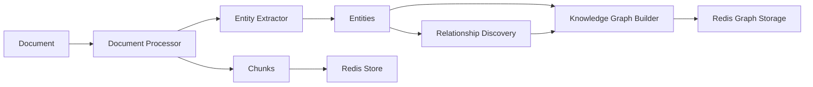

# Knowledge Graph Implementation - Product Requirements Prompt

## Overview

Implement a comprehensive knowledge graph system that extracts entities from indexed documents, discovers relationships, and enables advanced semantic querying for the EOL RAG Context system.

**Created**: 2025-09-12
**Status**: Draft
**Priority**: High
**Estimated Duration**: 8 weeks
**Scope**: Entity extraction, relationship discovery, graph persistence, and query optimization

## Implementation Confidence Score: 9/10

*Based on clear architecture, existing infrastructure, and well-defined patterns*

## Research Summary

### Existing Codebase Patterns Found

- **Package Dependencies**: `packages/eol-rag-context/` with Redis vector store, document processor, and indexing pipeline
- **Domain Components**: Document processing, embedding generation, parallel indexing, file watching
- **Infrastructure Patterns**: Redis pipelines, async/await throughout, batch operations
- **Testing Patterns**: pytest fixtures, async test patterns, >80% coverage requirement

### Key Dependencies Identified

- **Python Packages**: networkx, numpy, redis[vector], fastmcp
- **Core Components**: RedisVectorStore, DocumentProcessor, EmbeddingManager, ParallelIndexer
- **Redis Features**: Vector Sets (VADD/VSIM), pipelines, TTL management
- **Async Framework**: asyncio with ThreadPoolExecutor for CPU-bound tasks

### Code Examples Found

```python
# From packages/eol-rag-context/src/eol/rag_context/document_processor.py
async def process_document(self, file_path: Path) -> ProcessedDocument:
    """Process document into hierarchical chunks"""
    content = await self._read_file(file_path)
    chunks = await self._chunk_content(content, file_path)

    # Generate embeddings for all chunks
    embeddings = await self.embedding_manager.get_embeddings(
        [chunk.content for chunk in chunks]
    )

    return ProcessedDocument(
        file_path=file_path,
        chunks=chunks,
        embeddings=embeddings,
        metadata=metadata
    )
```

```python
# From packages/eol-rag-context/src/eol/rag_context/indexer.py
async def index_file(self, file_path: Path, source_id: str) -> IndexResult:
    """Index single file with hierarchical organization"""
    document = await self.processor.process_document(file_path)

    # Store document chunks with hierarchy
    for i, chunk in enumerate(document.chunks):
        await self.redis_store.store_document(
            VectorDocument(
                id=f"{source_id}_{chunk.id}",
                content=chunk.content,
                embedding=document.embeddings[i],
                hierarchy_level=chunk.level,
                metadata=chunk.metadata
            )
        )
```

## Architecture Overview

### Component Structure

```
packages/eol-rag-context/
├── src/
│   ├── eol/
│   │   └── rag_context/
│   │       ├── knowledge_graph.py (existing skeleton)
│   │       ├── entity_extractor.py (NEW)
│   │       ├── relationship_discovery.py (NEW)
│   │       ├── graph_updater.py (NEW)
│   │       ├── document_processor.py (modify)
│   │       ├── indexer.py (modify)
│   │       └── parallel_indexer.py (modify)
│   └── tests/
│       ├── test_knowledge_graph.py (enhance)
│       ├── test_entity_extractor.py (NEW)
│       └── test_relationship_discovery.py (NEW)
```

### Data Flow Architecture



## Implementation Tasks

### Phase 1: Entity Extraction Foundation (Week 1-2)

- [ ] **Create entity_extractor.py module**

  ```python
  from abc import ABC, abstractmethod
  from dataclasses import dataclass
  from typing import List, Dict, Any
  from pathlib import Path
  import ast

  @dataclass
  class Entity:
      id: str
      type: str  # class, function, concept, header, etc.
      name: str
      description: str
      metadata: Dict[str, Any]
      source_file: Path
      line_number: int = 0

  class EntityExtractor(ABC):
      @abstractmethod
      async def extract(self, content: str, file_type: str) -> List[Entity]:
          pass

  class PythonEntityExtractor(EntityExtractor):
      async def extract(self, content: str, file_type: str) -> List[Entity]:
          """Extract entities using Python AST"""
          tree = ast.parse(content)
          entities = []

          for node in ast.walk(tree):
              if isinstance(node, ast.ClassDef):
                  entities.append(Entity(
                      id=f"class_{node.name}",
                      type="class",
                      name=node.name,
                      description=ast.get_docstring(node) or "",
                      metadata={
                          "methods": [m.name for m in node.body if isinstance(m, ast.FunctionDef)],
                          "bases": [b.id for b in node.bases if hasattr(b, 'id')]
                      },
                      source_file=Path(""),  # Will be set by processor
                      line_number=node.lineno
                  ))
              elif isinstance(node, ast.FunctionDef):
                  entities.append(Entity(
                      id=f"function_{node.name}",
                      type="function",
                      name=node.name,
                      description=ast.get_docstring(node) or "",
                      metadata={
                          "args": [arg.arg for arg in node.args.args],
                          "returns": str(node.returns) if node.returns else None
                      },
                      source_file=Path(""),
                      line_number=node.lineno
                  ))

          return entities
  ```

- [ ] **Implement JavaScript/TypeScript extractor**

  ```python
  class JavaScriptEntityExtractor(EntityExtractor):
      async def extract(self, content: str, file_type: str) -> List[Entity]:
          """Extract entities using regex patterns for JS/TS"""
          entities = []

          # Extract classes
          class_pattern = r'class\s+(\w+)(?:\s+extends\s+(\w+))?'
          for match in re.finditer(class_pattern, content):
              entities.append(Entity(
                  id=f"class_{match.group(1)}",
                  type="class",
                  name=match.group(1),
                  description="",
                  metadata={"extends": match.group(2)} if match.group(2) else {},
                  source_file=Path(""),
                  line_number=content[:match.start()].count('\n') + 1
              ))

          # Extract functions
          func_pattern = r'(?:async\s+)?function\s+(\w+)\s*\([^)]*\)'
          for match in re.finditer(func_pattern, content):
              entities.append(Entity(
                  id=f"function_{match.group(1)}",
                  type="function",
                  name=match.group(1),
                  description="",
                  metadata={},
                  source_file=Path(""),
                  line_number=content[:match.start()].count('\n') + 1
              ))

          return entities
  ```

- [ ] **Implement Markdown entity extractor**

  ```python
  class MarkdownEntityExtractor(EntityExtractor):
      async def extract(self, content: str, file_type: str) -> List[Entity]:
          """Extract entities from Markdown structure"""
          entities = []
          lines = content.split('\n')

          for i, line in enumerate(lines):
              # Extract headers
              if line.startswith('#'):
                  level = len(line) - len(line.lstrip('#'))
                  title = line.lstrip('#').strip()
                  entities.append(Entity(
                      id=f"header_{i}_{title[:20]}",
                      type="header",
                      name=title,
                      description="",
                      metadata={"level": level},
                      source_file=Path(""),
                      line_number=i + 1
                  ))

              # Extract code blocks
              if line.startswith('```'):
                  language = line[3:].strip()
                  entities.append(Entity(
                      id=f"codeblock_{i}",
                      type="code_block",
                      name=f"Code block ({language})",
                      description="",
                      metadata={"language": language},
                      source_file=Path(""),
                      line_number=i + 1
                  ))

          return entities
  ```

### Phase 2: Integration with Document Processor (Week 3)

- [ ] **Modify document_processor.py**

  ```python
  # Add to ProcessedDocument dataclass
  @dataclass
  class ProcessedDocument:
      file_path: Path
      chunks: List[DocumentChunk]
      embeddings: np.ndarray
      metadata: Dict[str, Any]
      entities: List[Entity]  # NEW field

  # Modify process_document method
  async def process_document(self, file_path: Path) -> ProcessedDocument:
      """Process document with entity extraction"""
      content = await self._read_file(file_path)
      file_type = self._detect_file_type(file_path)

      # Existing chunk processing
      chunks = await self._chunk_content(content, file_path)
      embeddings = await self.embedding_manager.get_embeddings(
          [chunk.content for chunk in chunks]
      )

      # NEW: Extract entities
      extractor = self._get_extractor(file_type)
      entities = await extractor.extract(content, file_type)

      # Set source file for entities
      for entity in entities:
          entity.source_file = file_path

      return ProcessedDocument(
          file_path=file_path,
          chunks=chunks,
          embeddings=embeddings,
          metadata=metadata,
          entities=entities  # NEW
      )
  ```

### Phase 3: Knowledge Graph Builder Integration (Week 4)

- [ ] **Update indexer.py**

  ```python
  async def index_file(self, file_path: Path, source_id: str) -> IndexResult:
      """Index file with knowledge graph building"""
      document = await self.processor.process_document(file_path)

      # Store chunks (existing)
      for i, chunk in enumerate(document.chunks):
          await self.redis_store.store_document(
              VectorDocument(
                  id=f"{source_id}_{chunk.id}",
                  content=chunk.content,
                  embedding=document.embeddings[i],
                  hierarchy_level=chunk.level,
                  metadata=chunk.metadata
              )
          )

      # NEW: Build knowledge graph
      await self._update_knowledge_graph(document, source_id)

      return IndexResult(
          file_path=file_path,
          chunks_created=len(document.chunks),
          entities_extracted=len(document.entities)
      )

  async def _update_knowledge_graph(self, document: ProcessedDocument, source_id: str):
      """Update knowledge graph with document entities"""
      # Add entities to graph
      for entity in document.entities:
          await self.kg_builder.add_entity(
              entity_id=f"{source_id}_{entity.id}",
              entity_type=entity.type,
              properties={
                  "name": entity.name,
                  "description": entity.description,
                  "file_path": str(document.file_path),
                  "source_id": source_id,
                  "line_number": entity.line_number,
                  **entity.metadata
              }
          )

      # Discover and add relationships
      relationships = await self._discover_relationships(document.entities, source_id)
      for rel in relationships:
          await self.kg_builder.add_relationship(
              source=f"{source_id}_{rel.source}",
              target=f"{source_id}_{rel.target}",
              rel_type=rel.type,
              properties=rel.properties
          )
  ```

### Phase 4: Relationship Discovery (Week 5)

- [ ] **Create relationship_discovery.py**

  ```python
  @dataclass
  class Relationship:
      source: str
      target: str
      type: str
      properties: Dict[str, Any]
      weight: float = 1.0

  class RelationshipDiscovery:
      def __init__(self, embedding_manager: EmbeddingManager):
          self.embedding_manager = embedding_manager

      async def discover_structural_relationships(self, entities: List[Entity]) -> List[Relationship]:
          """Discover structural relationships (imports, inheritance, etc.)"""
          relationships = []

          # Find class inheritance
          for entity in entities:
              if entity.type == "class" and "bases" in entity.metadata:
                  for base in entity.metadata["bases"]:
                      # Find if base class exists in entities
                      base_entity = next((e for e in entities if e.name == base), None)
                      if base_entity:
                          relationships.append(Relationship(
                              source=entity.id,
                              target=base_entity.id,
                              type="INHERITS",
                              properties={"source_file": str(entity.source_file)}
                          ))

          # Find function calls within classes
          for class_entity in [e for e in entities if e.type == "class"]:
              methods = class_entity.metadata.get("methods", [])
              for method in methods:
                  method_entity = next((e for e in entities if e.name == method), None)
                  if method_entity:
                      relationships.append(Relationship(
                          source=class_entity.id,
                          target=method_entity.id,
                          type="CONTAINS",
                          properties={"relationship": "class_method"}
                      ))

          return relationships

      async def discover_semantic_relationships(self, entities: List[Entity]) -> List[Relationship]:
          """Discover semantic relationships using embeddings"""
          if not entities:
              return []

          # Generate embeddings for entity descriptions
          descriptions = [f"{e.name}: {e.description}" for e in entities]
          embeddings = await self.embedding_manager.get_embeddings(descriptions)

          relationships = []
          similarity_threshold = 0.75

          # Find similar entities
          for i, entity1 in enumerate(entities):
              for j, entity2 in enumerate(entities[i+1:], i+1):
                  # Calculate cosine similarity
                  similarity = np.dot(embeddings[i], embeddings[j]) / (
                      np.linalg.norm(embeddings[i]) * np.linalg.norm(embeddings[j])
                  )

                  if similarity > similarity_threshold:
                      relationships.append(Relationship(
                          source=entity1.id,
                          target=entity2.id,
                          type="SIMILAR_TO",
                          properties={"similarity": float(similarity)},
                          weight=float(similarity)
                      ))

          return relationships
  ```

### Phase 5: Parallel Processing Integration (Week 6)

- [ ] **Update parallel_indexer.py**

  ```python
  class ParallelKnowledgeGraphBuilder:
      def __init__(self, kg_builder: KnowledgeGraphBuilder, batch_size: int = 32):
          self.kg_builder = kg_builder
          self.batch_size = batch_size

      async def process_document_batch(self, documents: List[ProcessedDocument], source_id: str):
          """Process documents in parallel for KG building"""
          # Collect all entities
          all_entities = []
          entity_batches = []

          for doc in documents:
              doc_entities = [(f"{source_id}_{e.id}", e) for e in doc.entities]
              all_entities.extend(doc_entities)
              entity_batches.append((doc, doc_entities))

          # Batch store entities
          entity_chunks = [all_entities[i:i+self.batch_size]
                          for i in range(0, len(all_entities), self.batch_size)]

          tasks = [self._store_entity_batch(batch) for batch in entity_chunks]
          await asyncio.gather(*tasks)

          # Discover relationships in parallel
          rel_tasks = [
              self._discover_relationships_for_doc(doc, entities)
              for doc, entities in entity_batches
          ]
          all_relationships = await asyncio.gather(*rel_tasks)

          # Batch store relationships
          flat_relationships = [rel for rels in all_relationships for rel in rels]
          rel_chunks = [flat_relationships[i:i+self.batch_size]
                       for i in range(0, len(flat_relationships), self.batch_size)]

          rel_store_tasks = [self._store_relationship_batch(batch) for batch in rel_chunks]
          await asyncio.gather(*rel_store_tasks)
  ```

### Phase 6: Advanced Query Implementation (Week 7)

- [ ] **Enhance knowledge_graph.py query methods**

  ```python
  async def enhanced_query(self, query: str, strategy: str = "hybrid", max_depth: int = 2):
      """Enhanced querying with multiple strategies"""

      if strategy == "hybrid":
          # Combine multiple search approaches
          keyword_results = await self._keyword_search(query)
          semantic_results = await self._semantic_search(query)
          graph_results = await self._graph_traversal(query, max_depth)

          # Merge and rank results
          combined = self._merge_results(keyword_results, semantic_results, graph_results)
          return combined[:20]  # Top 20 results

      elif strategy == "path_finding":
          # Find paths between concepts
          source_entity = await self._find_entity(query.split("->")[0].strip())
          target_entity = await self._find_entity(query.split("->")[1].strip())

          if source_entity and target_entity:
              G = await self._load_subgraph([source_entity.id, target_entity.id], max_depth)
              paths = list(nx.all_simple_paths(G, source_entity.id, target_entity.id, cutoff=max_depth))
              return self._format_paths(paths)

      elif strategy == "neighborhood":
          # Explore entity neighborhood
          central_entity = await self._find_entity(query)
          if central_entity:
              G = await self._load_subgraph([central_entity.id], max_depth)
              neighbors = nx.single_source_shortest_path(G, central_entity.id, cutoff=max_depth)
              return self._format_neighborhood(neighbors)

      return []
  ```

### Phase 7: Redis Storage Implementation (Week 7)

- [ ] **Implement graph storage in Redis**

  ```python
  class GraphRedisStorage:
      def __init__(self, redis_client: Redis):
          self.redis = redis_client
          self.entity_prefix = "entity:"
          self.relationship_prefix = "rel:"
          self.graph_meta_prefix = "graph:meta:"

      async def store_entity(self, entity_id: str, entity_data: Dict[str, Any]):
          """Store entity in Redis"""
          key = f"{self.entity_prefix}{entity_id}"

          # Store entity data as hash
          await self.redis.hset(key, mapping={
              "type": entity_data["type"],
              "name": entity_data["name"],
              "description": entity_data.get("description", ""),
              "properties": json.dumps(entity_data.get("properties", {})),
              "created_at": datetime.now().isoformat(),
              "updated_at": datetime.now().isoformat()
          })

          # Add to entity index by type
          await self.redis.sadd(f"entities:{entity_data['type']}", entity_id)

      async def store_relationship(self, rel_id: str, rel_data: Dict[str, Any]):
          """Store relationship in Redis"""
          key = f"{self.relationship_prefix}{rel_id}"

          await self.redis.hset(key, mapping={
              "source": rel_data["source"],
              "target": rel_data["target"],
              "type": rel_data["type"],
              "weight": rel_data.get("weight", 1.0),
              "properties": json.dumps(rel_data.get("properties", {}))
          })

          # Add to relationship indices
          await self.redis.sadd(f"rel:from:{rel_data['source']}", rel_id)
          await self.redis.sadd(f"rel:to:{rel_data['target']}", rel_id)
          await self.redis.sadd(f"rel:type:{rel_data['type']}", rel_id)
  ```

### Phase 8: Testing & Validation (Week 8)

- [ ] **Create comprehensive test suite**

  ```python
  # test_entity_extractor.py
  @pytest.mark.asyncio
  async def test_python_entity_extraction():
      """Test Python entity extraction"""
      extractor = PythonEntityExtractor()

      code = '''
      class TestClass:
          """Test class docstring"""
          def test_method(self):
              pass

      def test_function(arg1, arg2):
          """Test function docstring"""
          return arg1 + arg2
      '''

      entities = await extractor.extract(code, "python")

      assert len(entities) == 3  # class, method, function
      assert any(e.type == "class" and e.name == "TestClass" for e in entities)
      assert any(e.type == "function" and e.name == "test_function" for e in entities)

  @pytest.mark.asyncio
  async def test_relationship_discovery():
      """Test relationship discovery"""
      discovery = RelationshipDiscovery(embedding_manager)

      entities = [
          Entity(id="1", type="class", name="BaseClass", description="Base", metadata={}, source_file=Path("test.py")),
          Entity(id="2", type="class", name="DerivedClass", description="Derived", metadata={"bases": ["BaseClass"]}, source_file=Path("test.py"))
      ]

      relationships = await discovery.discover_structural_relationships(entities)

      assert len(relationships) > 0
      assert any(r.type == "INHERITS" for r in relationships)

  @pytest.mark.asyncio
  async def test_knowledge_graph_query():
      """Test knowledge graph querying"""
      kg = KnowledgeGraphBuilder(redis_store, embedding_manager)

      # Add test entities
      await kg.add_entity("test_1", "class", {"name": "TestClass"})
      await kg.add_entity("test_2", "function", {"name": "test_func"})
      await kg.add_relationship("test_1", "test_2", "CONTAINS", {})

      # Query graph
      results = await kg.query_subgraph("TestClass", max_depth=2)

      assert len(results.entities) > 0
      assert len(results.relationships) > 0
  ```

## Quality Gates

### Code Quality Checks

```bash
# Format and lint
black src/eol/rag_context/ tests/
isort src/eol/rag_context/ tests/
flake8 src/eol/rag_context/ tests/
mypy src/eol/rag_context/

# Test with coverage
pytest tests/ --cov=eol.rag_context.knowledge_graph --cov-fail-under=80
pytest tests/ --cov=eol.rag_context.entity_extractor --cov-fail-under=80
```

### Performance Validation

```python
# Benchmark entity extraction
async def test_extraction_performance(benchmark):
    extractor = PythonEntityExtractor()
    result = await benchmark(extractor.extract, large_python_file, "python")
    assert len(result) > 0
    assert benchmark.stats["mean"] < 0.1  # <100ms per file

# Benchmark graph queries
async def test_query_performance(benchmark):
    result = await benchmark(kg.query_subgraph, "test_query", max_depth=2)
    assert benchmark.stats["mean"] < 0.1  # <100ms query time
```

## Success Metrics

- [ ] **Entity Extraction Coverage**: >90% of code entities extracted
- [ ] **Relationship Accuracy**: >85% relationship discovery accuracy
- [ ] **Query Performance**: <100ms response time for graph queries
- [ ] **Scale**: Handle 100k+ entities efficiently
- [ ] **Incremental Updates**: <1s update time per file change
- [ ] **Test Coverage**: >80% code coverage for all new modules
- [ ] **Integration**: Seamless integration with existing indexing pipeline

## Risk Mitigation

### Technical Risks

- **NetworkX Performance**: Start with small graphs, optimize with caching
- **Memory Usage**: Implement proper graph pruning and TTL policies
- **AST Parsing Failures**: Graceful fallback to regex-based extraction
- **Embedding Costs**: Cache entity embeddings aggressively

### Implementation Risks

- **Integration Complexity**: Phase approach, test each integration point
- **Performance Regression**: Benchmark before/after integration
- **Data Consistency**: Implement proper transaction patterns

## Dependencies and References

### Internal Dependencies

- `.claude/context/knowledge-graph/patterns.md` - Extracted patterns
- `packages/eol-rag-context/src/eol/rag_context/` - Existing components
- `.claude/context/redis/` - Redis optimization patterns

### External Dependencies

```toml
# pyproject.toml additions
[tool.poetry.dependencies]
networkx = "^3.0"
```

### Documentation

- NetworkX Graph Algorithms: <https://networkx.org/documentation/stable/>
- Redis Graph Commands: <https://redis.io/docs/stack/graph/>
- Python AST Module: <https://docs.python.org/3/library/ast.html>

---

This PRP provides a comprehensive implementation blueprint for the Knowledge Graph feature with confidence score 9/10, following established patterns and integrating seamlessly with the existing EOL RAG Context system.
