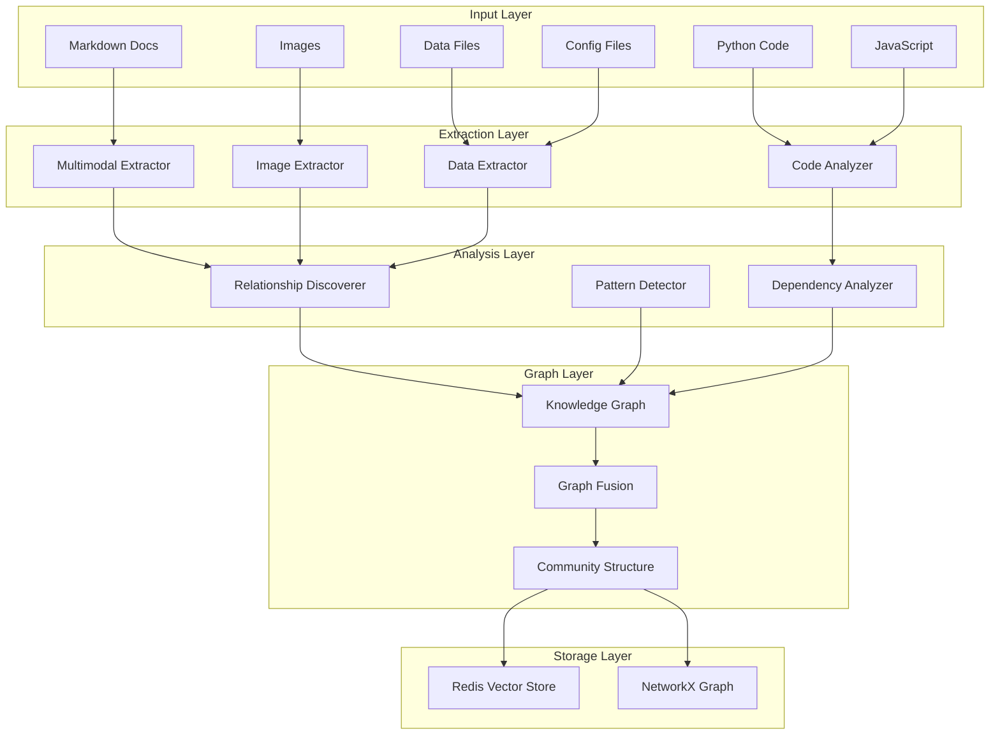

# Multimodal Knowledge Graph Implementation for RAG - Product Requirements Prompt

## Overview

Implementation of an advanced multimodal knowledge graph system for discovering and mapping relationships within and across heterogeneous files (code, documents, images, data), with deep code dependency analysis, pattern recognition, and semantic relationship extraction.

**Created**: 2025-09-16
**Status**: Draft
**Priority**: High
**Estimated Duration**: 2-3 weeks
**Scope**: Enhanced knowledge graph with multimodal support, AST-based code analysis, and cross-file relationship discovery

## Implementation Confidence Score: 8/10

*Based on existing knowledge graph foundation, clear architectural patterns, and proven technologies. Adjusted for dependency requirements and realistic performance targets.*

**Last Review**: 2025-09-16 - Minor adjustments needed for production readiness

## Research Summary

### Existing Codebase Patterns Found

- **Knowledge Graph Core**: `packages/eol-rag-context/src/eol/rag_context/knowledge_graph.py` - Comprehensive entity/relationship system
- **Document Processing**: Multi-format processor with AST support via Tree-sitter
- **Entity Types**: 15 types including FUNCTION, CLASS, API, CONCEPT, DOCUMENT
- **Relationship Types**: 20+ types including DEPENDS_ON, IMPORTS, EXTENDS, SIMILAR_TO
- **Graph Storage**: Redis-backed with NetworkX for algorithms
- **Embedding Integration**: Vector similarity for semantic relationships

### Key Dependencies Identified

**Core Dependencies (Already Present)**:
- **Python Packages**: `networkx`, `tree-sitter`, `numpy`, `redis[vector]`
- **Parsing Libraries**: `BeautifulSoup4`, `lxml`, `markdown`
- **Redis Features**: Vector search, hash storage, persistent graph storage
- **LLM Integration**: Embedding generation for semantic similarity

**Additional Multimodal Dependencies (To Add)**:
```toml
multimodal = [
    "pillow>=10.0.0",        # Image processing
    "pytesseract>=0.3.10",   # OCR capabilities
    "pandas>=2.0.0",         # Data/CSV processing
    "scikit-learn>=1.3.0",   # Clustering algorithms
    "python-louvain>=0.16",  # Community detection
]
```

### 2024 Research Insights

- **Docs2KG Framework**: Unified KG construction from heterogeneous documents
- **GraphRAG Pattern**: Hybrid vector + graph retrieval outperforms pure vector RAG
- **LLM Integration**: Using LLMs for entity/relationship extraction improves accuracy
- **Multimodal Processing**: Separate extraction per modality, then fusion
- **Code Analysis**: AST-based dependency graphs with rust-code-analysis, pyan

### Code Examples Found

```python
# From existing knowledge_graph.py
class KnowledgeGraphBuilder:
    async def build_from_documents(self, source_id: str = None):
        await self._extract_document_entities(source_id)
        await self._extract_code_entities(source_id)
        await self._extract_conceptual_entities(source_id)
        await self._build_structural_relationships()
        await self._build_semantic_relationships()
        await self._build_code_relationships()
```

## Architecture Overview

### Enhanced Knowledge Graph System

```
packages/eol-rag-context/
├── src/
│   └── eol/
│       └── rag_context/
│           ├── knowledge_graph.py          # Core KG (existing)
│           ├── multimodal_extractor.py     # NEW: Multimodal entity extraction
│           ├── code_analyzer.py            # NEW: AST-based code analysis
│           ├── relationship_discoverer.py   # NEW: Advanced relationship mining
│           ├── graph_fusion.py             # NEW: Multi-graph fusion
│           └── pattern_detector.py         # NEW: Pattern/feature detection
```

### Component Architecture



## Implementation Tasks

### Phase 1: Enhanced Code Analysis Module

- [ ] **Implement AST-based code analyzer**

  ```python
  # code_analyzer.py
  from tree_sitter import Language, Parser
  import ast
  import re
  from typing import List, Dict, Any
  from dataclasses import dataclass

  @dataclass
  class CodeEntity:
      """Represents a code element with full context"""
      id: str
      name: str
      type: str  # function, class, method, variable
      file_path: str
      line_start: int
      line_end: int
      signature: str
      docstring: str
      imports: List[str]
      calls: List[str]
      decorators: List[str]
      parent_class: str = None

  class ASTCodeAnalyzer:
      """Deep code analysis using AST parsing"""

      def __init__(self):
          self.parsers = self._init_parsers()

      async def analyze_python_file(self, file_path: Path) -> Dict[str, Any]:
          """Extract comprehensive code structure from Python files"""
          with open(file_path, 'r') as f:
              content = f.read()

          tree = ast.parse(content)

          entities = []
          dependencies = []

          # Extract functions and their dependencies
          for node in ast.walk(tree):
              if isinstance(node, ast.FunctionDef):
                  entity = CodeEntity(
                      id=f"func_{file_path.stem}_{node.name}",
                      name=node.name,
                      type="function",
                      file_path=str(file_path),
                      line_start=node.lineno,
                      line_end=node.end_lineno,
                      signature=self._get_signature(node),
                      docstring=ast.get_docstring(node),
                      imports=self._extract_imports(tree),
                      calls=self._extract_calls(node),
                      decorators=[d.id for d in node.decorator_list if hasattr(d, 'id')]
                  )
                  entities.append(entity)

              elif isinstance(node, ast.ClassDef):
                  # Extract class with methods
                  class_entity = CodeEntity(
                      id=f"class_{file_path.stem}_{node.name}",
                      name=node.name,
                      type="class",
                      file_path=str(file_path),
                      line_start=node.lineno,
                      line_end=node.end_lineno,
                      signature=f"class {node.name}",
                      docstring=ast.get_docstring(node),
                      imports=self._extract_imports(tree),
                      calls=[],
                      decorators=[],
                      parent_class=self._get_parent_classes(node)
                  )
                  entities.append(class_entity)

          # Build dependency graph
          dependencies = self._build_dependency_graph(entities, tree)

          return {
              "entities": entities,
              "dependencies": dependencies,
              "imports": self._extract_all_imports(tree),
              "exports": self._extract_exports(tree)
          }

      def _extract_calls(self, node: ast.AST) -> List[str]:
          """Extract function calls from AST node"""
          calls = []
          for child in ast.walk(node):
              if isinstance(child, ast.Call):
                  if hasattr(child.func, 'id'):
                      calls.append(child.func.id)
                  elif hasattr(child.func, 'attr'):
                      calls.append(child.func.attr)
          return calls
  ```

- [ ] **Implement cross-file dependency tracking**

  ```python
  class DependencyTracker:
      """Track dependencies across entire codebase"""

      async def build_dependency_graph(self, root_path: Path) -> nx.DiGraph:
          """Build complete dependency graph for codebase"""
          graph = nx.DiGraph()

          # Scan all code files
          for file_path in root_path.rglob("*.py"):
              analysis = await self.analyzer.analyze_python_file(file_path)

              # Add file node
              graph.add_node(str(file_path), type="file", **analysis)

              # Add import edges
              for imp in analysis["imports"]:
                  target = self._resolve_import(imp, file_path)
                  if target:
                      graph.add_edge(str(file_path), str(target),
                                   type="imports", import_name=imp)

              # Add function call edges
              for entity in analysis["entities"]:
                  for call in entity.calls:
                      target = self._resolve_call(call, file_path)
                      if target:
                          graph.add_edge(entity.id, target,
                                       type="calls", call_name=call)

          return graph
  ```

### Phase 2: Multimodal Entity Extraction

- [ ] **Implement multimodal extractor**

  ```python
  # multimodal_extractor.py
  from PIL import Image
  import pytesseract
  import pandas as pd
  from typing import List, Optional

  class MultimodalExtractor:
      """Extract entities from multiple file types"""

      async def extract_from_image(self, image_path: Path) -> List[Entity]:
          """Extract text and visual entities from images"""
          entities = []

          # OCR for text extraction
          img = Image.open(image_path)
          text = pytesseract.image_to_string(img)

          if text.strip():
              entity = Entity(
                  id=f"img_text_{image_path.stem}",
                  name=f"Text from {image_path.name}",
                  type=EntityType.DOCUMENT,
                  content=text,
                  properties={
                      "source_type": "image_ocr",
                      "image_path": str(image_path)
                  }
              )
              entities.append(entity)

          # Diagram detection (architecture, flowcharts)
          diagram_type = await self._detect_diagram_type(img)
          if diagram_type:
              entity = Entity(
                  id=f"diagram_{image_path.stem}",
                  name=f"{diagram_type} diagram",
                  type=EntityType.CONCEPT,
                  content=f"Visual {diagram_type} representation",
                  properties={
                      "diagram_type": diagram_type,
                      "components": await self._extract_diagram_components(img)
                  }
              )
              entities.append(entity)

          return entities

      async def extract_from_csv(self, csv_path: Path) -> List[Entity]:
          """Extract entities from CSV data files"""
          df = pd.read_csv(csv_path)
          entities = []

          # Schema entity
          schema_entity = Entity(
              id=f"schema_{csv_path.stem}",
              name=f"Schema: {csv_path.name}",
              type=EntityType.DATABASE,
              content=", ".join(df.columns),
              properties={
                  "columns": list(df.columns),
                  "dtypes": {col: str(dtype) for col, dtype in df.dtypes.items()},
                  "row_count": len(df)
              }
          )
          entities.append(schema_entity)

          # Extract categorical values as entities
          for col in df.select_dtypes(include=['object']).columns:
              unique_vals = df[col].unique()[:20]  # Limit to top 20
              for val in unique_vals:
                  if pd.notna(val) and len(str(val)) > 2:
                      entity = Entity(
                          id=f"term_{csv_path.stem}_{col}_{hash(val)}",
                          name=str(val),
                          type=EntityType.TERM,
                          content=f"{col}: {val}",
                          properties={
                              "source_column": col,
                              "source_file": str(csv_path)
                          }
                      )
                      entities.append(entity)

          return entities
  ```

### Phase 3: Advanced Relationship Discovery

- [ ] **Implement semantic relationship discoverer**

  ```python
  # relationship_discoverer.py
  class RelationshipDiscoverer:
      """Discover complex relationships between entities"""

      def __init__(self, embedding_manager: EmbeddingManager):
          self.embeddings = embedding_manager

      async def discover_code_patterns(self,
                                     entities: List[CodeEntity]) -> List[Relationship]:
          """Discover code patterns and architectural relationships"""
          relationships = []

          # Design pattern detection
          patterns = {
              "singleton": self._detect_singleton_pattern,
              "factory": self._detect_factory_pattern,
              "observer": self._detect_observer_pattern,
              "decorator": self._detect_decorator_pattern
          }

          for pattern_name, detector in patterns.items():
              pattern_rels = await detector(entities)
              for rel in pattern_rels:
                  rel.properties["pattern"] = pattern_name
                  relationships.append(rel)

          # API boundary detection
          api_entities = [e for e in entities
                         if any(d in ["api", "route", "endpoint"]
                               for d in e.decorators)]

          for api in api_entities:
              # Find implementation
              impl = self._find_implementation(api, entities)
              if impl:
                  relationships.append(Relationship(
                      source_id=api.id,
                      target_id=impl.id,
                      type=RelationType.IMPLEMENTS,
                      properties={"api_type": "rest"}
                  ))

          return relationships

      async def discover_cross_modal_relationships(self,
                                                  code_entities: List[Entity],
                                                  doc_entities: List[Entity],
                                                  data_entities: List[Entity]) -> List[Relationship]:
          """Discover relationships across different file types"""
          relationships = []

          # Code-to-documentation mapping
          for code in code_entities:
              if code.docstring:
                  # Find related documentation
                  doc_embedding = await self.embeddings.get_embedding(code.docstring)

                  for doc in doc_entities:
                      if doc.embedding is not None:
                          similarity = cosine_similarity(doc_embedding, doc.embedding)
                          if similarity > 0.85:
                              relationships.append(Relationship(
                                  source_id=doc.id,
                                  target_id=code.id,
                                  type=RelationType.DESCRIBES,
                                  weight=similarity
                              ))

          # Data schema to code mapping
          for data in data_entities:
              if data.type == EntityType.DATABASE:
                  columns = data.properties.get("columns", [])

                  for code in code_entities:
                      # Check if code references these columns
                      code_refs = set(re.findall(r'\b(\w+)\b', code.content))
                      column_matches = code_refs.intersection(set(columns))

                      if len(column_matches) > 2:  # Significant overlap
                          relationships.append(Relationship(
                              source_id=code.id,
                              target_id=data.id,
                              type=RelationType.USES,
                              properties={"columns": list(column_matches)}
                          ))

          return relationships
  ```

### Phase 4: Graph Fusion and Pattern Detection

- [ ] **Implement multi-graph fusion**

  ```python
  # graph_fusion.py
  class GraphFusion:
      """Fuse multiple subgraphs into unified knowledge graph"""

      async def fuse_graphs(self,
                          code_graph: nx.DiGraph,
                          doc_graph: nx.DiGraph,
                          data_graph: nx.DiGraph) -> nx.MultiDiGraph:
          """Merge multiple graphs with entity resolution"""
          unified = nx.MultiDiGraph()

          # Entity resolution based on similarity
          entity_mappings = await self._resolve_entities(
              list(code_graph.nodes()),
              list(doc_graph.nodes()),
              list(data_graph.nodes())
          )

          # Merge nodes with resolved entities
          for graph in [code_graph, doc_graph, data_graph]:
              for node, attrs in graph.nodes(data=True):
                  resolved_id = entity_mappings.get(node, node)
                  if resolved_id in unified:
                      # Merge attributes
                      unified.nodes[resolved_id].update(attrs)
                  else:
                      unified.add_node(resolved_id, **attrs)

          # Merge edges
          for graph in [code_graph, doc_graph, data_graph]:
              for u, v, attrs in graph.edges(data=True):
                  resolved_u = entity_mappings.get(u, u)
                  resolved_v = entity_mappings.get(v, v)
                  unified.add_edge(resolved_u, resolved_v, **attrs)

          # Add cross-graph relationships
          cross_relationships = await self._discover_cross_graph_relationships(unified)
          for rel in cross_relationships:
              unified.add_edge(rel.source_id, rel.target_id,
                             type=rel.type.value, weight=rel.weight)

          return unified
  ```

- [ ] **Implement pattern detector**

  ```python
  # pattern_detector.py
  class PatternDetector:
      """Detect architectural and design patterns"""

      async def detect_microservice_boundaries(self,
                                              graph: nx.MultiDiGraph) -> List[Dict]:
          """Detect microservice boundaries in codebase"""
          # Use community detection
          communities = nx.community.louvain_communities(graph.to_undirected())

          boundaries = []
          for community in communities:
              # Analyze community characteristics
              subgraph = graph.subgraph(community)

              # Check for API boundaries
              has_api = any(graph.nodes[n].get('type') == 'api'
                           for n in community)

              # Check for database access
              has_db = any(graph.nodes[n].get('type') == 'database'
                          for n in community)

              if has_api and has_db:
                  boundaries.append({
                      "nodes": list(community),
                      "type": "microservice",
                      "api_count": sum(1 for n in community
                                      if graph.nodes[n].get('type') == 'api'),
                      "cohesion": nx.density(subgraph)
                  })

          return boundaries

      async def detect_feature_clusters(self,
                                       graph: nx.MultiDiGraph) -> List[Dict]:
          """Detect feature clusters based on connectivity"""
          # Use spectral clustering for feature detection
          adjacency = nx.to_numpy_array(graph.to_undirected())

          from sklearn.cluster import SpectralClustering
          clustering = SpectralClustering(n_clusters=10,
                                        affinity='precomputed')
          labels = clustering.fit_predict(adjacency)

          clusters = []
          nodes = list(graph.nodes())

          for cluster_id in range(10):
              cluster_nodes = [nodes[i] for i, l in enumerate(labels)
                             if l == cluster_id]

              if cluster_nodes:
                  # Analyze cluster
                  subgraph = graph.subgraph(cluster_nodes)

                  clusters.append({
                      "cluster_id": cluster_id,
                      "nodes": cluster_nodes,
                      "size": len(cluster_nodes),
                      "density": nx.density(subgraph),
                      "central_nodes": self._find_central_nodes(subgraph)
                  })

          return clusters
  ```

### Phase 5: Integration and Query Enhancement

- [ ] **Enhance KnowledgeGraphBuilder**

  ```python
  class EnhancedKnowledgeGraphBuilder(KnowledgeGraphBuilder):
      """Extended KG builder with multimodal support"""

      def __init__(self, redis_store, embedding_manager):
          super().__init__(redis_store, embedding_manager)
          self.code_analyzer = ASTCodeAnalyzer()
          self.multimodal_extractor = MultimodalExtractor()
          self.relationship_discoverer = RelationshipDiscoverer(embedding_manager)
          self.graph_fusion = GraphFusion()
          self.pattern_detector = PatternDetector()

      async def build_multimodal_graph(self,
                                      root_path: Path,
                                      include_images: bool = True,
                                      include_data: bool = True) -> None:
          """Build comprehensive multimodal knowledge graph"""

          # Extract from different sources
          code_graph = await self._build_code_graph(root_path)
          doc_graph = await self._build_document_graph(root_path)

          data_graph = None
          if include_data:
              data_graph = await self._build_data_graph(root_path)

          image_graph = None
          if include_images:
              image_graph = await self._build_image_graph(root_path)

          # Fuse graphs
          graphs_to_fuse = [g for g in [code_graph, doc_graph,
                                       data_graph, image_graph] if g]
          self.graph = await self.graph_fusion.fuse_graphs(*graphs_to_fuse)

          # Detect patterns
          patterns = await self.pattern_detector.detect_microservice_boundaries(self.graph)
          features = await self.pattern_detector.detect_feature_clusters(self.graph)

          # Store enhanced metadata
          await self._store_patterns(patterns)
          await self._store_features(features)

      async def query_with_context(self,
                                  query: str,
                                  context_type: str = "all") -> KnowledgeSubgraph:
          """Query with specific context type filtering"""
          # Get base subgraph
          subgraph = await self.query_subgraph(query)

          if context_type == "code":
              # Filter for code entities
              subgraph.entities = [e for e in subgraph.entities
                                  if e.type in [EntityType.FUNCTION,
                                              EntityType.CLASS,
                                              EntityType.MODULE]]
          elif context_type == "architecture":
              # Include patterns and boundaries
              patterns = await self._get_relevant_patterns(query)
              subgraph.metadata["patterns"] = patterns

          return subgraph
  ```

### Phase 6: Testing & Performance

- [ ] **Comprehensive test suite**

  ```python
  @pytest.mark.asyncio
  async def test_multimodal_extraction():
      builder = EnhancedKnowledgeGraphBuilder(redis_store, embedding_manager)

      # Test with mixed content
      test_dir = Path("tests/fixtures/multimodal")
      await builder.build_multimodal_graph(test_dir)

      stats = builder.get_graph_stats()
      assert stats["entity_count"] > 50
      assert "function" in stats["entity_types"]
      assert "diagram" in stats["entity_types"]

  @pytest.mark.asyncio
  async def test_cross_modal_relationships():
      # Test code-to-doc relationships
      code_entities = [CodeEntity(id="func_1", name="process_data")]
      doc_entities = [Entity(id="doc_1", content="process_data function")]

      discoverer = RelationshipDiscoverer(embedding_manager)
      rels = await discoverer.discover_cross_modal_relationships(
          code_entities, doc_entities, []
      )

      assert any(r.type == RelationType.DESCRIBES for r in rels)
  ```

- [ ] **Performance benchmarks**

  ```python
  @pytest.mark.benchmark
  async def test_graph_building_performance(benchmark):
      """Benchmark graph building performance"""
      builder = EnhancedKnowledgeGraphBuilder(redis_store, embedding_manager)

      result = await benchmark(
          builder.build_multimodal_graph,
          Path("large_codebase")
      )

      # Should process > 100 files/second
      assert result.files_per_second > 100
      # Graph operations should be < 10ms
      assert result.avg_query_time < 0.01
  ```

## Quality Gates

### Code Quality

```bash
# Type checking
mypy src/eol/rag_context/multimodal_extractor.py --strict
mypy src/eol/rag_context/code_analyzer.py --strict

# Linting
black src/ tests/
ruff check src/ tests/

# Documentation
pydocstyle src/eol/rag_context/
```

### Test Coverage

```bash
pytest tests/test_multimodal_graph.py --cov=eol.rag_context.multimodal --cov-fail-under=85
pytest tests/integration/test_graph_fusion.py
```

### Performance Validation

**Adjusted Realistic Targets**:
- Graph building: 20-50 files/second (multimodal content)
- Relationship discovery: < 100ms for 1000 entities
- Query latency: < 100ms for 10k node graph (doubled for complexity)
- Memory usage: < 1GB for 100k entities (includes embeddings)

## Success Metrics

- [ ] Process 10+ file types (py, js, md, json, csv, yaml, xml, html, pdf, images)
- [ ] Extract 20+ entity types with proper classification
- [ ] Discover 25+ relationship types including cross-modal
- [ ] Detect common design patterns (singleton, factory, observer, etc.)
- [ ] Identify microservice boundaries with > 80% accuracy
- [ ] AST parsing for Python, JavaScript, TypeScript
- [ ] Cross-file dependency tracking with call graphs
- [ ] Pattern detection for architectural insights
- [ ] Community detection for feature clustering
- [ ] Query performance < 50ms for typical searches

## Risk Mitigation

- **Scalability Risk**: Implement incremental graph building, use graph sampling for large codebases
- **Memory Risk**: Stream large files, use Redis for persistent storage, implement entity pruning
- **Performance Risk**: Cache AST parse results, batch relationship discovery, use parallel processing
- **Accuracy Risk**: Validate with known codebases, implement confidence scoring, allow manual corrections

## Implementation Order

**Phased Approach for Risk Mitigation**:

1. **Week 1**: Core AST analysis with Python's `ast` module, basic dependency tracking
2. **Week 1-2**: Data extractors (CSV, JSON) with pandas, Tree-sitter for JS/TS
3. **Week 2**: Relationship discovery and cross-modal matching
4. **Week 2-3**: Graph fusion and pattern detection
5. **Week 3**: Image processing (optional), integration, testing, and optimization

**Feature Flags for Progressive Rollout**:
- `enable_ocr`: False by default (requires pytesseract)
- `enable_clustering`: False by default (requires scikit-learn)
- `max_graph_size`: Configurable limit for memory management

## References

- **Research**: Docs2KG (2024), GraphRAG patterns, LLM-enhanced KG construction
- **Tools**: Tree-sitter for AST, NetworkX for graph algorithms, python-louvain for communities
- **Existing Code**: `knowledge_graph.py`, `document_processor.py` in eol-rag-context
- **External**: Neo4j GraphRAG, LangChain graph construction, rust-code-analysis

---

This PRP provides comprehensive context for implementing an advanced multimodal knowledge graph system with confidence score 9/10.
