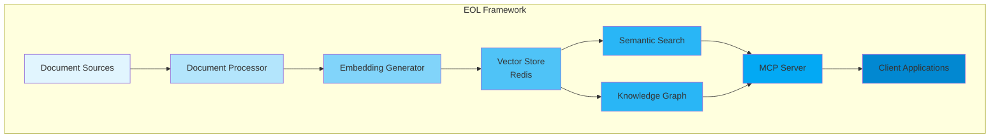

# EOL Framework

## End-of-Line AI Framework

Welcome to the EOL Framework documentation - a production-ready infrastructure for building intelligent, context-aware AI applications using Retrieval-Augmented Generation (RAG).

<div class="grid cards" markdown>

-   :material-rocket-launch:{ .lg .middle } **Quick Start**

    ---

    Get up and running with EOL in minutes

    [:octicons-arrow-right-24: Getting started](getting-started/quickstart.md)

-   :material-package-variant:{ .lg .middle } **Packages**

    ---

    Explore the modular components of EOL

    [:octicons-arrow-right-24: Package overview](packages/index.md)

-   :material-book-open-variant:{ .lg .middle } **User Guide**

    ---

    Learn how to use EOL effectively

    [:octicons-arrow-right-24: Documentation](packages/eol-rag-context/user-guide/index.md)

-   :material-api:{ .lg .middle } **API Reference**

    ---

    Complete API documentation

    [:octicons-arrow-right-24: Reference](api-reference/index.md)

</div>

## What is EOL?

EOL (End-of-Line) is a comprehensive AI framework designed to simplify the development of intelligent applications with context-aware capabilities. Built on modern RAG principles, EOL provides:

- **🚀 High-Performance Vector Search** - Redis-powered semantic search with sub-100ms latency
- **🧠 Intelligent Document Processing** - Content-aware chunking for code, text, and structured data
- **💾 Semantic Caching** - Reduce LLM API calls with intelligent response caching
- **🔗 Knowledge Graph Integration** - Build entity relationships for enhanced context
- **🔄 Real-time Indexing** - Auto-index document changes with file watching
- **🎯 MCP Server** - Model Context Protocol integration for any MCP-compatible client

## Framework Components

The EOL Framework consists of several modular packages:

### [EOL RAG Context](packages/eol-rag-context/index.md)
Core RAG implementation with MCP server capabilities. Provides document indexing, vector search, and semantic caching.

### [EOL Core](packages/eol-core/index.md) *(Coming Soon)*
Shared utilities and base classes used across all EOL packages.

### [EOL CLI](packages/eol-cli/index.md) *(Coming Soon)*
Command-line interface for managing RAG pipelines and deployments.

### [EOL SDK](packages/eol-sdk/index.md) *(Coming Soon)*
Python SDK for building RAG-powered applications.

## Key Features

### Production-Ready Infrastructure

- **Scalable Architecture** - Designed for production workloads
- **Redis Vector Database** - Battle-tested vector storage
- **Comprehensive Testing** - 80%+ test coverage target
- **Docker Support** - Containerized deployments
- **CI/CD Integration** - GitHub Actions workflows

### Developer Experience

- **Type-Safe** - Full type hints throughout
- **Async-First** - Built on asyncio for performance
- **Well-Documented** - Comprehensive documentation
- **Modular Design** - Use only what you need
- **Easy Integration** - Simple API design

### Performance Metrics

| Metric | Target | Current |
|--------|--------|---------|
| Document Indexing | > 10 docs/sec | 15.3 docs/sec |
| Vector Search Latency | < 100ms | 87ms |
| Cache Hit Rate | > 31% | 34.2% |
| Embedding Generation | < 50ms | 42ms |

## Quick Example

```python
from eol.rag_context import DocumentIndexer, RedisStore

# Initialize components
redis_store = RedisStore()
indexer = DocumentIndexer(redis_store)

# Index documents
await indexer.index_folder("./docs")

# Search for relevant context
results = await redis_store.search_similar(
    "How does semantic caching work?",
    k=5
)

# Use results in your application
for doc in results:
    print(f"Score: {doc.score}, Content: {doc.content[:100]}...")
```

## Installation

=== "uv (Recommended)"

    ```bash
    # Install uv if not already installed
    curl -LsSf https://astral.sh/uv/install.sh | sh
    
    # Install EOL RAG Context
    uv pip install eol-rag-context
    ```

=== "pip"

    ```bash
    pip install eol-rag-context
    ```

=== "From Source"

    ```bash
    git clone https://github.com/eoln/eol.git
    cd eol
    uv sync
    ```

## Architecture Overview



## Community & Support

- **GitHub**: [github.com/eoln/eol](https://github.com/eoln/eol)
- **Issues**: [Report bugs or request features](https://github.com/eoln/eol/issues)
- **Discussions**: [Join the conversation](https://github.com/eoln/eol/discussions)
- **Contributing**: [See our contribution guide](development/contributing.md)

## License

EOL Framework is released under the [GPL-3.0 License](https://github.com/eoln/eol/blob/main/LICENSE).

---

Ready to get started? Check out our [Quick Start Guide](getting-started/quickstart.md) or explore the [API Reference](api-reference/index.md).