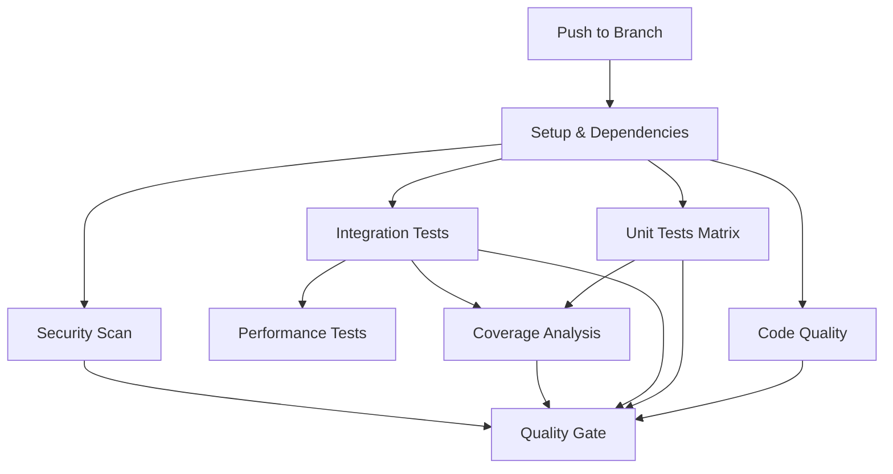

# Consolidated CI/CD Workflow

## Overview

Single, comprehensive workflow that handles all CI/CD needs for the EOL RAG Context package. Simplified from 5 separate workflows into 1 unified pipeline.

## Workflow Structure



## Jobs Breakdown

### 1. 🔧 Setup & Dependencies

- **Purpose**: Validates project structure and builds dependency cache
- **Duration**: 30s (cache hit) / 3min (cache miss)
- **Outputs**: Cache key and change detection
- **Key Features**:
  - Detects if package files changed
  - Validates required project files
  - Creates shared dependency cache
  - Pre-downloads ML models

### 2. 📊 Code Quality

- **Purpose**: Runs all code quality checks
- **Duration**: 30s
- **Dependencies**: Setup
- **Checks**:
  - Black (code formatting)
  - isort (import sorting)
  - flake8 (linting)
  - bandit (security)
  - safety (dependency vulnerabilities)

### 3. 🧪 Unit Tests (Matrix)

- **Purpose**: Runs unit tests across Python versions
- **Duration**: 2min per version (parallel)
- **Matrix**: Python 3.11, 3.12, 3.13
- **Features**:
  - Parallel execution with pytest-xdist
  - Coverage collection
  - Individual caching per Python version

### 4. 🔄 Integration Tests

- **Purpose**: Tests with Redis and full system
- **Duration**: 3min
- **Dependencies**: Setup + Unit Tests
- **Services**: Redis Stack (with RediSearch)
- **Features**:
  - Real Redis testing
  - Parallel test execution
  - Coverage collection with append

### 5. ⚡ Performance Tests

- **Purpose**: Benchmarks critical performance metrics
- **Duration**: 2min
- **Dependencies**: Setup + Integration Tests
- **Features**:
  - pytest-benchmark integration
  - Performance regression detection
  - Benchmark result artifacts

### 6. 📈 Coverage Analysis

- **Purpose**: Merges all coverage and validates threshold
- **Duration**: 30s
- **Dependencies**: Unit Tests + Integration Tests
- **Features**:
  - Merges coverage from all test jobs
  - Validates 80% threshold
  - Generates coverage badge

### 7. 🔒 Security Scan

- **Purpose**: Comprehensive security analysis
- **Duration**: 1min
- **Dependencies**: Setup
- **Tools**:
  - Trivy (vulnerability scanning)
  - Safety (dependency security)
  - SARIF upload to GitHub Security

### 8. 🚦 Quality Gate

- **Purpose**: Final pass/fail decision
- **Duration**: 10s
- **Dependencies**: All previous jobs
- **Decision Logic**: Fails if any critical job fails

## Trigger Configuration

### Push-Only Triggers

```yaml
on:
  push:
    branches: [ main, develop, feat/*, fix/* ]
    paths:
      - 'packages/eol-rag-context/**'
      - '.github/workflows/eol-rag-context.yml'
      - '.github/actions/setup-python-deps/**'
      - '.github/scripts/**'
```

### Benefits of Push-Only

- **Simpler**: No duplicate runs for PRs
- **Faster**: Single pipeline execution
- **Clearer**: One source of truth for CI status
- **Cost-effective**: Reduced GitHub Actions minutes

## Performance Optimizations

### Dependency Caching Strategy

```yaml
cache-key: deps-${{ runner.os }}-py${{ python-version }}-${{ hashFiles('requirements') }}
```

### Parallel Execution

- Unit tests run in parallel across Python versions
- Integration and performance tests run sequentially after unit tests
- Quality and security scans run in parallel with tests

### Smart Skip Logic

- Entire workflow skips if no package files changed
- Individual jobs respect dependencies
- Coverage analysis runs even if some tests fail

## Resource Usage

| Job | Duration | CPU | Memory | Parallelism |
|-----|----------|-----|--------|-------------|
| Setup | 30s-3m | 1 core | 1GB | - |
| Quality | 30s | 1 core | 512MB | - |
| Unit Tests | 2m | 4 cores | 2GB | 3 jobs |
| Integration | 3m | 4 cores | 4GB | 1 job |
| Performance | 2m | 2 cores | 2GB | 1 job |
| Coverage | 30s | 1 core | 512MB | - |
| Security | 1m | 1 core | 1GB | - |
| Quality Gate | 10s | 1 core | 256MB | - |

**Total Pipeline Time**: ~4-5 minutes (vs previous 8-10 minutes)

## Artifact Management

### Generated Artifacts

- `unit-test-results-{python-version}` - JUnit XML and coverage
- `integration-test-results` - Integration test results and coverage
- `performance-results` - Benchmark JSON data
- `final-coverage` - Merged coverage reports and badge
- `trivy-results.sarif` - Security scan results

### Retention Policy

- Test results: 30 days
- Coverage reports: 30 days
- Performance data: 7 days
- Security scans: Upload to GitHub Security tab

## Monitoring and Debugging

### Workflow Status

```bash
# Check workflow status
gh workflow list
gh workflow view eol-rag-context.yml

# Check specific run
gh run list --workflow=eol-rag-context.yml
gh run view <run-id>
```

### Debug Failed Jobs

```bash
# View logs for failed job
gh run view <run-id> --log-failed

# Download artifacts
gh run download <run-id>
```

### Common Issues and Solutions

#### Cache Miss

- **Symptom**: Setup job takes 3+ minutes
- **Cause**: Requirements changed or cache expired
- **Solution**: Normal behavior, subsequent runs will be fast

#### Unit Test Failures

- **Symptom**: Different results across Python versions
- **Cause**: Version-specific issues
- **Solution**: Check specific Python version logs

#### Integration Test Failures

- **Symptom**: Redis connection errors
- **Cause**: Service not ready or resource limits
- **Solution**: Check Redis service health, reduce parallelism

#### Coverage Below Threshold

- **Symptom**: Coverage gate fails
- **Cause**: Insufficient test coverage
- **Solution**: Add tests or adjust threshold

## Migration from Multiple Workflows

### Before (5 Workflows)

- `eol-rag-context-quality-gate.yml` - Main pipeline
- `eol-rag-context-integration-optimized.yml` - Fast integration
- `eol-rag-context-quality-gate-optimized.yml` - Optimized pipeline
- `dependency-cache.yml` - Dependency pre-building
- `build-test-image.yml` - Docker image building

### After (1 Workflow)

- `eol-rag-context.yml` - Complete CI/CD pipeline

### Benefits of Consolidation

1. **Simplicity**: Single workflow to maintain
2. **Efficiency**: Shared dependency caching
3. **Clarity**: Clear job dependencies
4. **Reliability**: Consistent execution environment
5. **Cost**: Reduced GitHub Actions usage

## Future Enhancements

### Conditional Job Execution

- Skip performance tests for documentation changes
- Skip integration tests for unit-only changes
- Smart test selection based on file changes

### Advanced Caching

- Layer-aware dependency caching
- Cross-workflow cache sharing
- Incremental test execution

### Deployment Integration

- Automatic deployment on main branch
- Environment-specific testing
- Release automation

## Best Practices

1. **Keep It Simple**: Single workflow is easier to maintain
2. **Use Dependencies**: Leverage job dependencies for efficiency
3. **Cache Aggressively**: Cache everything that's expensive to build
4. **Fail Fast**: Run quality checks early
5. **Parallel When Possible**: Maximize concurrent execution
6. **Monitor Performance**: Track workflow execution times
