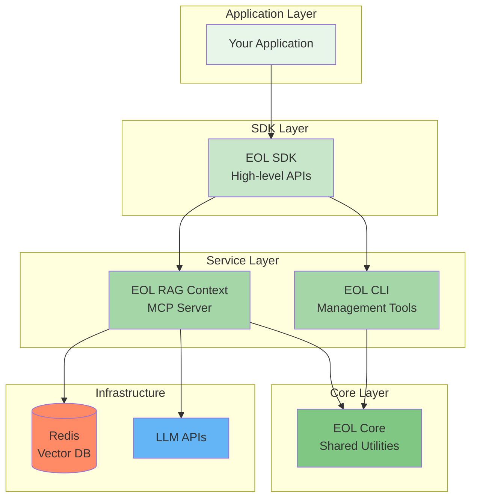
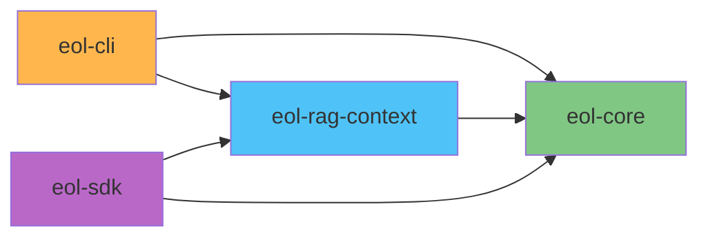

# Packages Overview

The EOL Framework is organized as a monorepo with multiple specialized packages, each serving a specific purpose in the RAG ecosystem.

## Available Packages

### 📦 [EOL RAG Context](eol-rag-context/index.md)

**Status**: ✅ Production Ready
**Version**: 0.3.0

The core RAG implementation providing:

- Document indexing and processing
- Vector search with Redis
- Semantic caching
- Knowledge graph integration
- MCP server for client integration
- File watching for real-time updates

[Learn more →](eol-rag-context/index.md)

### 🛠 [EOL Core](eol-core/index.md)

**Status**: 🚧 In Development
**Version**: 0.1.0 (planned)

Shared utilities and base classes:

- Common data structures
- Utility functions
- Base classes for extensibility
- Shared configuration management

[Coming soon →](eol-core/index.md)

### 💻 [EOL CLI](eol-cli/index.md)

**Status**: 📋 Planned
**Version**: TBD

Command-line interface for EOL:

- Pipeline management
- Deployment tools
- Testing utilities
- Performance monitoring

[View roadmap →](eol-cli/index.md)

### 🔧 [EOL SDK](eol-sdk/index.md)

**Status**: 📋 Planned
**Version**: TBD

Python SDK for building applications:

- High-level abstractions
- Application templates
- Integration helpers
- Example applications

[View roadmap →](eol-sdk/index.md)

## Package Architecture



## Installation

Each package can be installed independently based on your needs:

### Install Individual Packages

```bash
# Core RAG functionality
uv pip install eol-rag-context

# Core utilities (when available)
uv pip install eol-core

# CLI tools (when available)
uv pip install eol-cli

# SDK (when available)
uv pip install eol-sdk
```

### Install Everything

```bash
# Install all available packages
uv pip install eol[all]
```

### Development Installation

```bash
# Clone the repository
git clone https://github.com/eoln/eol.git
cd eol

# Install with uv (recommended)
uv sync

# Or install with pip
pip install -e ".[dev]"
```

## Package Dependencies



## Version Compatibility

| Package | Python | Redis | Status |
|---------|--------|-------|--------|
| eol-rag-context | ≥3.11 | ≥7.2 | Stable |
| eol-core | ≥3.11 | - | Development |
| eol-cli | ≥3.11 | - | Planned |
| eol-sdk | ≥3.11 | ≥7.2 | Planned |

## Development Status

### Current Focus

We're currently focusing on:

1. **eol-rag-context**: Enhancing core RAG capabilities
2. **Test coverage**: Achieving 80%+ coverage
3. **Documentation**: Comprehensive guides and examples
4. **Performance**: Optimizing indexing and search

### Roadmap

**Q1 2025**

- ✅ eol-rag-context v0.3.0 release
- 🚧 eol-core initial release
- 📋 eol-cli development start

**Q2 2025**

- 📋 eol-sdk initial release
- 📋 Enhanced knowledge graph features
- 📋 Multi-modal support

## Contributing

We welcome contributions to all packages! See our [Contributing Guide](../development/contributing.md) for details.

### Package-Specific Guidelines

- **eol-rag-context**: Focus on performance and reliability
- **eol-core**: Ensure backward compatibility
- **eol-cli**: Prioritize user experience
- **eol-sdk**: Emphasize developer ergonomics

## Support

- **Documentation**: You're reading it!
- **GitHub Issues**: [Report bugs](https://github.com/eoln/eol/issues)
- **Discussions**: [Ask questions](https://github.com/eoln/eol/discussions)

---

Ready to dive deeper? Explore the [EOL RAG Context](eol-rag-context/index.md) package to get started with RAG capabilities.
