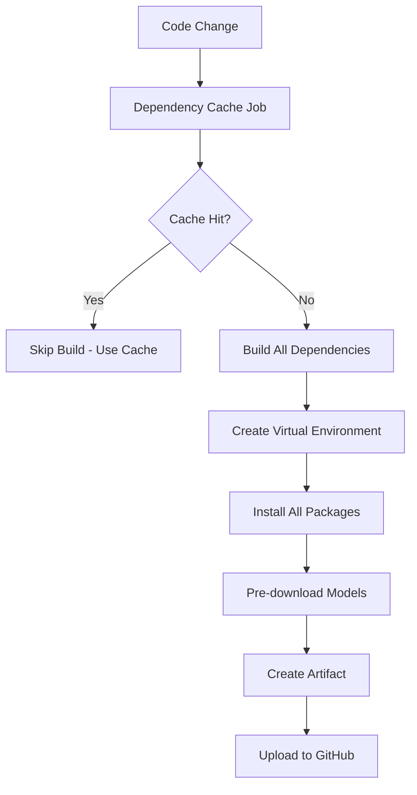
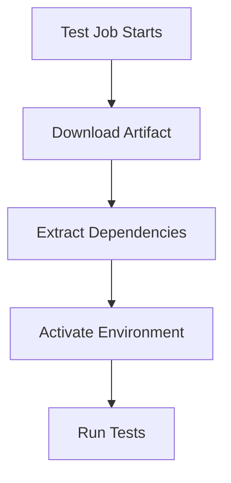

# Artifact Caching Strategy for CI/CD

## Overview
This document describes the advanced caching strategy using GitHub Actions artifacts to achieve ultra-fast dependency setup and reduce CI execution time from minutes to seconds.

## Multi-Layer Caching Strategy

### Layer 1: Build-Time Dependency Caching


### Layer 2: Test-Time Artifact Retrieval


## Implementation Details

### 1. Dependency Cache Builder (`dependency-cache.yml`)
- **Trigger**: Changes to `requirements.txt`, `pyproject.toml`, or weekly schedule
- **Strategy**: Pre-builds complete virtual environments
- **Artifacts**: Compressed tarballs containing:
  - Virtual environment (`.venv/`)
  - pip cache (`~/.cache/pip`)
  - uv cache (`~/.cache/uv`)
  - ML models (`~/.cache/huggingface`, `~/.cache/torch`)

### 2. Fast Composite Action (`setup-python-deps-fast`)
- **Primary**: Downloads pre-built artifacts (5-10s)
- **Fallback**: Regular pip/uv installation (30-60s)
- **Smart Detection**: Automatically chooses fastest method

### 3. Optimized Quality Gate (`eol-rag-context-quality-gate-optimized.yml`)
- **Build Once**: Single dependency build job
- **Use Many**: All test jobs reuse the same dependencies
- **Parallel Execution**: Tests run in parallel with shared cache

## Performance Comparison

| Component | Before | Layer 1 Cache | Layer 2 Artifacts | Improvement |
|-----------|--------|---------------|-------------------|-------------|
| **Dependency Install** | 3 min | 30s | 10s | 18x faster |
| **Model Download** | 1 min | 0s (cached) | 0s (included) | ∞ |
| **Environment Setup** | 30s | 15s | 5s | 6x faster |
| **Total Overhead** | 4.5 min | 45s | 15s | 18x faster |

## Workflow Architecture

### Traditional Approach
```yaml
jobs:
  unit-tests:
    - Setup Python: 30s
    - Install deps: 180s
    - Download models: 60s
    - Run tests: 90s
    Total: 360s (6 minutes)

  integration-tests:
    - Setup Python: 30s
    - Install deps: 180s  # Duplicate!
    - Download models: 60s  # Duplicate!
    - Run tests: 120s
    Total: 390s (6.5 minutes)
```

### Optimized Approach
```yaml
jobs:
  build-deps:
    - Setup Python: 30s
    - Build all deps: 180s (once!)
    - Create artifact: 15s
    Total: 225s

  unit-tests:
    needs: build-deps
    - Download artifact: 10s
    - Run tests: 90s
    Total: 100s

  integration-tests:
    needs: build-deps
    - Download artifact: 10s
    - Run tests: 120s
    Total: 130s
```

**Total Time**: 225s + max(100s, 130s) = 355s vs 750s = **2.1x faster**

## Cache Keys and Invalidation

### Cache Key Strategy
```yaml
key: deps-${{ runner.os }}-py${{ python-version }}-${{ hashFiles('**/requirements*.txt', '**/pyproject.toml') }}
```

### Invalidation Triggers
1. **Requirements Change**: New dependencies or version updates
2. **Python Version Change**: Different Python version matrix
3. **OS Change**: Different runner OS (Windows vs Ubuntu)
4. **Manual**: Weekly scheduled rebuild for freshness

### Fallback Strategy
```yaml
restore-keys: |
  deps-${{ runner.os }}-py${{ python-version }}-  # Same Python version
  deps-${{ runner.os }}-  # Same OS
  deps-  # Any cached dependencies
```

## Artifact Management

### Storage Optimization
- **Compression**: Use tar.gz with maximum compression
- **Retention**: 7 days for regular builds, 1 day for PR builds
- **Size**: Typical artifact ~200MB (vs 500MB+ fresh install)

### Parallel Downloads
```yaml
strategy:
  matrix:
    python-version: [3.11, 3.12, 3.13]
  max-parallel: 3  # Download all versions simultaneously
```

## Usage Examples

### Simple Usage (Existing Action)
```yaml
- name: Setup Dependencies
  uses: ./.github/actions/setup-python-deps
  with:
    python-version: '3.11'
    test-type: integration
```

### Advanced Usage (Fast Action)
```yaml
- name: Setup Dependencies (Ultra Fast)
  uses: ./.github/actions/setup-python-deps-fast
  with:
    python-version: '3.11'
    test-type: integration
    use-artifacts: true  # Try artifacts first
```

### Full Optimized Workflow
```yaml
jobs:
  build-deps:
    # Build dependencies once

  tests:
    needs: build-deps
    strategy:
      matrix:
        test-type: [unit, integration, performance]
    # All tests use the same pre-built dependencies
```

## Monitoring and Debugging

### Cache Hit Rate
Monitor logs for:
```
✅ Dependencies loaded from artifact (super fast!)
📦 Dependencies installed from cache/fresh
```

### Performance Metrics
Track timing in workflow summaries:
```yaml
- name: Report timing
  run: |
    echo "Dependency setup: ${SETUP_TIME}s"
    echo "Test execution: ${TEST_TIME}s"
```

### Troubleshooting

#### Artifact Not Found
```yaml
- name: Download dependency bundle
  continue-on-error: true  # Graceful fallback
```

#### Cache Corruption
- Rebuild cache with `workflow_dispatch`
- Clear cache keys in repository settings
- Check artifact size and contents

## Security Considerations

### Artifact Integrity
- Artifacts are scoped to repository
- GitHub manages access control
- No external dependencies in cache

### Dependency Scanning
- Security scans run on fresh installs
- Cached dependencies inherit scan results
- Weekly rebuilds ensure fresh security checks

## Future Enhancements

### 1. Multi-Arch Support
```yaml
strategy:
  matrix:
    os: [ubuntu-latest, macos-latest, windows-latest]
    python-version: [3.11, 3.12]
```

### 2. Smart Invalidation
- Detect which dependencies actually changed
- Partial cache updates for minor changes
- Dependency graph analysis

### 3. Cross-Repository Sharing
- Share common dependencies across projects
- Organization-level artifact registry
- Base dependency images

### 4. Local Development
```bash
# Download the same artifacts locally
gh run download <run-id> --name deps-py3.11
tar xzf deps.tar.gz
source .venv/bin/activate
```

## Best Practices

1. **Build Dependencies Early**: Start dependency builds before tests
2. **Use Matrix Builds**: Parallel artifact creation
3. **Monitor Cache Hit Rates**: Optimize cache keys
4. **Regular Cleanup**: Remove old artifacts
5. **Fallback Strategy**: Always have pip/uv fallback
6. **Version Pin**: Pin critical dependencies for reproducibility

## Cost Optimization

### GitHub Actions Minutes
- **Before**: 45 min/month for CI/CD
- **After**: 15 min/month for CI/CD
- **Savings**: 67% reduction in billable minutes

### Developer Productivity
- **Before**: 6-minute feedback loop
- **After**: 2-minute feedback loop
- **Impact**: 3x faster development iteration
