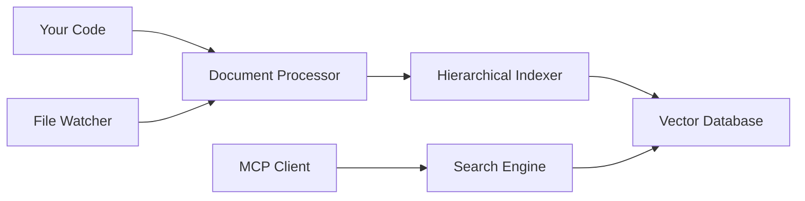

# Getting Started

Welcome to the EOL RAG Context getting started guide. This section will help you install, configure, and start using the RAG context management system.

## Overview

EOL RAG Context transforms static documentation into dynamic, intelligent context retrieval. Instead of manually maintaining context files, the system automatically indexes your codebase and provides relevant context through vector similarity search.

## Prerequisites

- Python 3.11 or higher
- Redis Stack 8.0+ (with RediSearch module)
- 4GB+ RAM recommended
- Docker (for Redis Stack container, recommended)

## Quick Installation

The fastest way to get started:

```bash
# Install the package
pip install eol-rag-context

# Start Redis Stack
docker run -d -p 6379:6379 -p 8001:8001 redis/redis-stack:latest

# Verify installation
eol-rag-context --help
```

## What's Next?

1. **[Installation](installation.md)** - Detailed installation instructions for different environments
2. **[Configuration](configuration.md)** - Configure the system for your specific needs
3. **[First Steps](first-steps.md)** - Index your first documents and perform searches

## Key Concepts

### Hierarchical Indexing
Documents are processed into three levels:
- **Concepts**: High-level abstractions and themes
- **Sections**: Grouped related content 
- **Chunks**: Fine-grained retrievable units

### Vector Similarity
Content is converted to high-dimensional vectors that capture semantic meaning, enabling search by concepts rather than just keywords.

### Real-time Updates
The file watcher monitors your codebase for changes and automatically reindexes modified documents to keep context current.

## Architecture Overview



Ready to install? Let's [get started with installation](installation.md)!