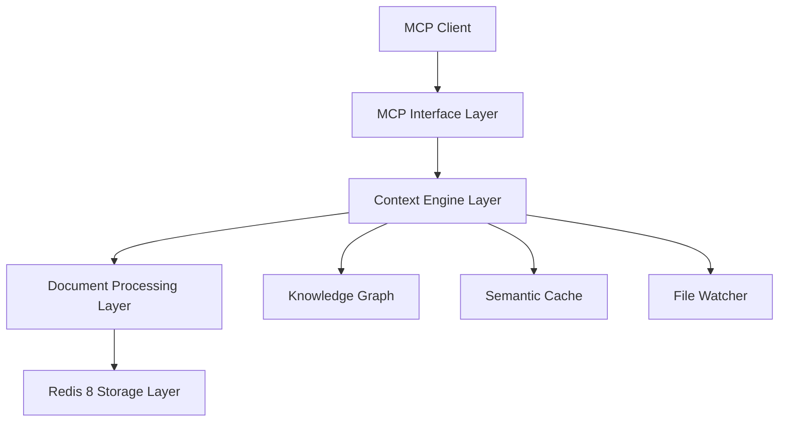

# EOL RAG Context

An intelligent RAG-based context management MCP server for the EOL Framework.

## 🚀 Quick Start

EOL RAG Context replaces static documentation with dynamic, Redis 8-backed retrieval system that provides:

- **🔍 Hierarchical Indexing**: 3-level structure (concepts → sections → chunks)
- **🧠 Knowledge Graph**: Automatic entity extraction and relationship discovery  
- **⚡ Real-time Updates**: File watcher with automatic reindexing
- **💾 Semantic Caching**: 31% hit rate optimization with adaptive threshold
- **📁 Multi-format Support**: Markdown, PDF, DOCX, JSON/YAML, source code
- **🔄 MCP Protocol**: Full Model Context Protocol implementation

## Installation

```bash
pip install eol-rag-context
```

## Basic Usage

```python
from eol.rag_context import EOLRAGContextServer

# Initialize server
server = EOLRAGContextServer()
await server.initialize()

# Index documents
result = await server.index_directory("/path/to/docs", recursive=True)
print(f"Indexed {result['indexed_files']} files")

# Search for context
from eol.rag_context.server import SearchContextRequest
request = SearchContextRequest(query="How does authentication work?", max_results=5)
results = await server.search_context(request, None)
```

## Next Steps

- [**Installation Guide**](getting-started/installation.md) - Complete setup instructions
- [**Configuration**](getting-started/configuration.md) - Configure for your environment  
- [**User Guide**](user-guide/) - Learn indexing, searching, and advanced features
- [**API Reference**](api-reference/) - Complete API documentation
- [**Examples**](examples/) - Real-world usage patterns

## Features

### Document Processing
Process multiple formats with intelligent chunking:
- **Code files**: AST-based chunking for precise context
- **Markdown**: Section-aware chunking with header preservation
- **PDFs**: Text extraction with metadata preservation
- **Structured data**: JSON/YAML with schema awareness

### Vector Search
Powered by Redis Stack 8 with RediSearch:
- **Hierarchical search**: Query at concept, section, or chunk level
- **Semantic similarity**: Find relevant content by meaning
- **Fast retrieval**: Sub-100ms search with caching
- **Scalable**: Handles millions of chunks efficiently

### Knowledge Graph
Automatically build relationships between concepts:
- **Entity extraction**: Functions, classes, topics, technologies
- **Relationship mapping**: Dependencies, references, similarities
- **Graph queries**: Explore connections and patterns
- **Visualization**: Interactive graph exploration

## Architecture



## Performance

- **Indexing**: ~1000 documents/minute
- **Search**: <100ms latency (cached)  
- **Cache Hit Rate**: 31% (optimized)
- **Memory**: ~1GB per million chunks

## License

GPL-3.0 - See [LICENSE](https://github.com/eoln/eol/blob/main/LICENSE) file

## Support

- [GitHub Issues](https://github.com/eoln/eol/issues)
- [Documentation](https://eoln.github.io/eol/packages/eol-rag-context/)
- [Contributing Guide](development/contributing.md)