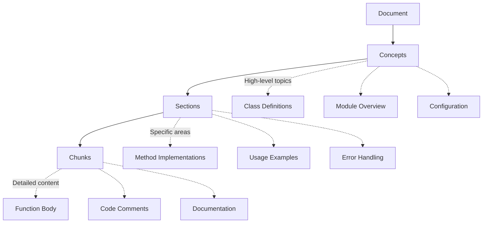

# User Guide

Welcome to the EOL RAG Context User Guide. This comprehensive guide covers everything you need to know about using the intelligent RAG-based context management system effectively.

## What You'll Learn

This guide is organized into four main sections:

### 📁 [Document Indexing](indexing.md)
Learn how to index various document types with intelligent chunking strategies:
- **Multi-format support**: Code, Markdown, PDF, DOCX, JSON/YAML
- **Hierarchical indexing**: 3-level structure (concepts → sections → chunks)  
- **Intelligent chunking**: AST-based for code, semantic for text
- **Metadata extraction**: File attributes, language detection, structure analysis
- **Batch processing**: Efficient large-scale indexing

### 🔍 [Search & Retrieval](searching.md)
Master the art of semantic search and context retrieval:
- **Vector similarity search**: Find relevant content by meaning, not just keywords
- **Hierarchical queries**: Search at concept, section, or chunk level
- **Advanced filtering**: By file type, date range, similarity threshold
- **Result ranking**: Semantic relevance, recency, document structure
- **Context assembly**: Intelligent context window management

### 🚀 [Advanced Features](advanced-features.md)
Explore powerful features for sophisticated use cases:
- **Knowledge graphs**: Automatic entity extraction and relationship discovery
- **Semantic caching**: 31% hit rate optimization with adaptive thresholds  
- **Real-time updates**: File watching with automatic reindexing
- **Performance monitoring**: Metrics, analytics, and optimization
- **Custom providers**: Extend with your own embedding models

### 🔌 [MCP Integration](integrations.md)
Connect with Claude Desktop and other MCP clients:
- **Claude Desktop setup**: Complete configuration guide
- **MCP protocol**: Tool usage and best practices
- **Custom integrations**: Build your own MCP clients
- **API integration**: Direct Python API usage patterns

## Quick Navigation

### By Experience Level

**New Users Start Here:**
1. [Installation](../getting-started/installation.md) - Get up and running
2. [First Steps](../getting-started/first-steps.md) - Your first indexing session
3. [Basic Indexing](indexing.md#basic-indexing) - Index your first documents
4. [Simple Searches](searching.md#basic-search) - Find what you need

**Experienced Users:**
1. [Advanced Indexing](indexing.md#advanced-strategies) - Optimization techniques
2. [Complex Queries](searching.md#advanced-queries) - Sophisticated search patterns
3. [Knowledge Graphs](advanced-features.md#knowledge-graphs) - Relationship discovery
4. [Performance Tuning](advanced-features.md#performance-optimization) - Scale effectively

### By Use Case

**Code Documentation:**
- [Code Indexing](indexing.md#code-files) - AST-based chunking
- [Function Search](searching.md#code-search) - Find specific implementations
- [API Discovery](advanced-features.md#api-analysis) - Understand codebases

**Research & Knowledge Management:**
- [Document Collections](indexing.md#document-collections) - Large document sets
- [Semantic Search](searching.md#semantic-queries) - Concept-based retrieval
- [Knowledge Graphs](advanced-features.md#knowledge-graphs) - Concept relationships

**Team Collaboration:**
- [Shared Knowledge](integrations.md#team-setups) - Multi-user configurations
- [Real-time Updates](advanced-features.md#file-watching) - Collaborative editing
- [Performance Monitoring](advanced-features.md#monitoring) - System health

## Core Concepts

### Hierarchical Organization

EOL RAG Context organizes information in a three-level hierarchy:



### Intelligent Chunking

Different strategies optimize for different content types:

| Content Type | Strategy | Benefits |
|-------------|----------|----------|
| **Python Code** | AST-based | Preserves function/class boundaries |
| **Markdown** | Header-based | Maintains document structure |
| **Plain Text** | Semantic | Respects paragraph boundaries |
| **JSON/YAML** | Structure-based | Preserves data relationships |
| **PDFs** | Paragraph-based | Natural text flow |

### Vector Similarity

Content is converted to high-dimensional vectors that capture semantic meaning:

- **Embeddings**: Text → 384-dimensional vectors (default)
- **Similarity**: Cosine distance between vectors
- **Search**: Find vectors closest to query vector
- **Ranking**: Sort by similarity score + other factors

## Getting the Most from This Guide

### Follow the Learning Path

Each section builds on the previous one:

1. **Start with basics** - Even if experienced, skim the fundamentals
2. **Try examples** - Every concept includes working code samples
3. **Experiment** - Modify examples with your own data
4. **Optimize** - Apply performance tips to your use case

### Use the Interactive Elements

**Code Samples**: All examples are tested and ready to run:
```python
# Copy and run this code
from eol.rag_context import EOLRAGContextServer
server = EOLRAGContextServer()
# ... complete examples in each section
```

**Configuration Examples**: Ready-to-use YAML configurations:
```yaml
# production-ready configurations
indexing:
  chunk_size: 1000
  chunk_overlap: 200
# ... complete configs in relevant sections  
```

**Troubleshooting Guides**: Common issues and solutions embedded throughout

### Reference Materials

Each section includes:
- **Quick Reference**: Command summaries and key parameters
- **Best Practices**: Learned from production deployments
- **Performance Tips**: Optimization techniques
- **Common Pitfalls**: What to avoid

## Support and Community

### Getting Help

**Documentation Issues:**
- Missing information? [Open an issue](https://github.com/eoln/eol/issues)
- Found an error? [Submit a correction](https://github.com/eoln/eol/pulls)

**Technical Support:**
- Search [existing issues](https://github.com/eoln/eol/issues)
- Check [troubleshooting guides](../examples/troubleshooting.md)
- Join community discussions

**Contributing:**
- Improve documentation: [Contributing Guide](../development/contributing.md)
- Share examples: Add to [Examples](../examples/)
- Report bugs: [Bug Reports](https://github.com/eoln/eol/issues/new)

### Best Practices from the Community

**Indexing Strategies:**
- Start small, scale gradually
- Use appropriate file patterns
- Monitor performance metrics
- Tune chunk sizes for your content

**Search Optimization:**
- Be specific in queries
- Use hierarchical search levels
- Leverage semantic caching
- Monitor hit rates and adjust thresholds

**Production Deployment:**
- Use Redis clustering for scale
- Monitor memory usage
- Implement proper logging
- Set up health checks

## What's Next?

Choose your path based on your immediate needs:

### I want to index documents effectively
→ **[Document Indexing Guide](indexing.md)**
Learn chunking strategies, file patterns, and batch processing

### I want to search more effectively  
→ **[Search & Retrieval Guide](searching.md)**
Master semantic search, filters, and result ranking

### I want to use advanced features
→ **[Advanced Features Guide](advanced-features.md)**
Explore knowledge graphs, caching, and performance optimization

### I want to integrate with applications
→ **[Integration Guide](integrations.md)**
Connect with Claude Desktop, build MCP clients, use the API

### I want to see working examples
→ **[Examples Section](../examples/)**
Real-world usage patterns, troubleshooting, and sample code

---

**Ready to dive deeper?** Start with [Document Indexing](indexing.md) to learn how to effectively organize and process your content for optimal retrieval.